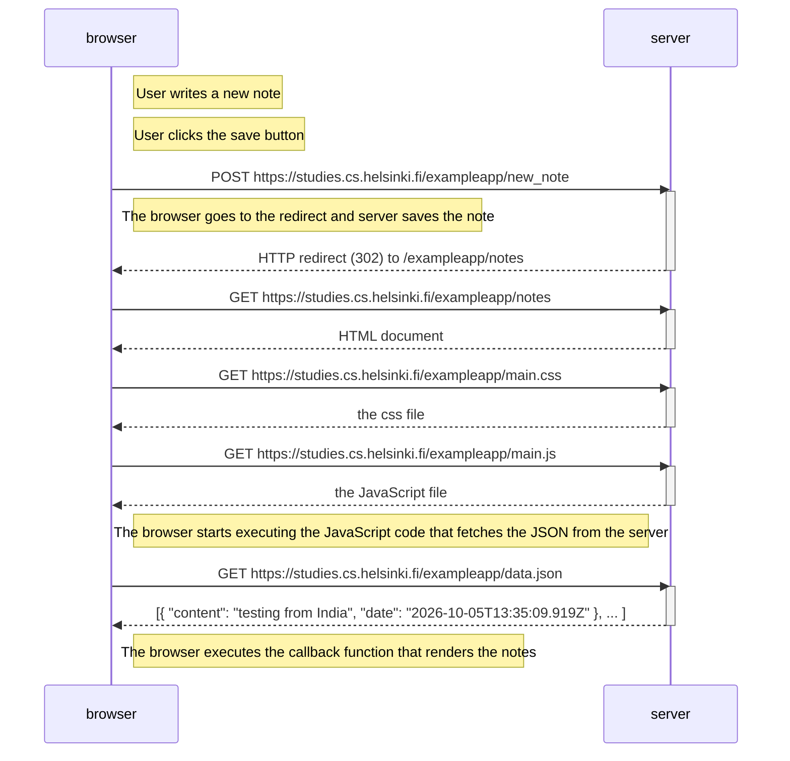

```mermaid
sequenceDiagram
    participant browser
    participant server

    Note right of browser: User writes a new note
    Note right of browser: User clicks the save button

    browser->>server: POST https://studies.cs.helsinki.fi/exampleapp/new_note
    activate server
    Note right of browser: The browser goes to the redirect and server saves the note
    server-->>browser: HTTP redirect (302) to /exampleapp/notes
    deactivate server

    browser->>server: GET https://studies.cs.helsinki.fi/exampleapp/notes
    activate server
    server-->>browser: HTML document
    deactivate server

    browser->>server: GET https://studies.cs.helsinki.fi/exampleapp/main.css
    activate server
    server-->>browser: the css file
    deactivate server

    browser->>server: GET https://studies.cs.helsinki.fi/exampleapp/main.js
    activate server
    server-->>browser: the JavaScript file
    deactivate server

    Note right of browser: The browser starts executing the JavaScript code that fetches the JSON from the server

    browser->>server: GET https://studies.cs.helsinki.fi/exampleapp/data.json
    activate server
    server-->>browser: [{ "content": "testing from India", "date": "2026-10-05T13:35:09.919Z" }, ... ]
    deactivate server  

    Note right of browser: The browser executes the callback function that renders the notes
```

